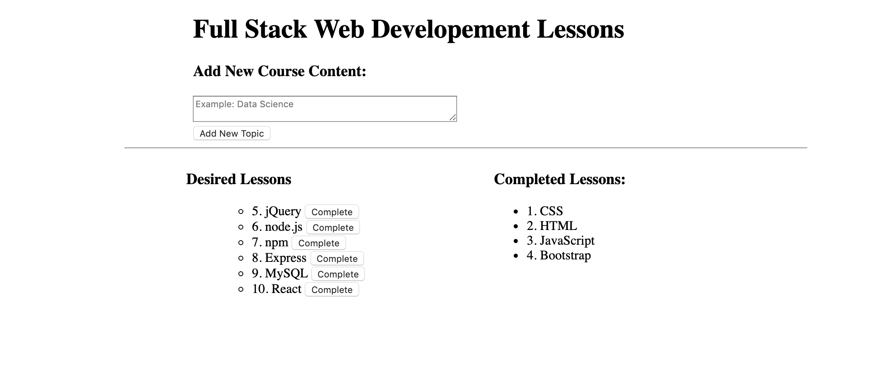
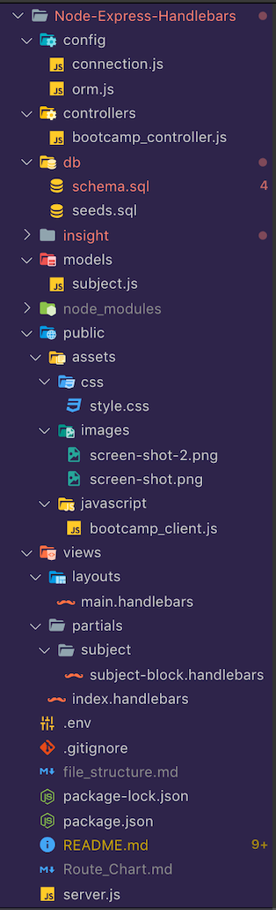

# Friend-Finder
Node and Express Servers

## App Screen Shot:



## Link to full app demo on Heroku:
https://dry-cove-69674.herokuapp.com/

## About the project:

My theme for this assignment is a basic todo-list with a Web Developement Lessons theme. The assignment is to create an app that lets users input something they want to do (like eat a burger or in this case, learn a new web technology). 

This app lets users input the names of web technologies they would like to learn. I've already pre-loaded some technologies, but the user has the ability to add new ones they wish to learn.

## User Guide:

1. Type in any one topic (at a time) in the New Course Content box and it will be displayed on the left side under "Desired Lessons".
  
2. Click on the "completed" button and the course will move over to the right side under "Completed Lessons".

## MVP Objectives:

 * Whenever a user submits a new topic, the app should display it on the left side of the page.

 * Each topic has a completed button. When the user clicks it, the topic will move to the right side of the page.

 * This app stores every subject in a database, whether completed or not.

## Stretch Goals:

  
## Techology Stack:
  * Node.js
  * JavaScript
  * npm express
  * npm body-parser
  * npm path
  * Heroku

## Methodology:
.
My approach to building this app was to closely follow the class activities in Handlebars, Express and MySQL. I used the in-class Cats app assignement as a guideline.

## Problems That I Overcame:

 * Deploying to Heroku was one problem. I got help from Danny, our TA and he helped guide me and he rest of the class through propely setting up the JAWSDB on Heroku and formatting our connections and tables on MySQL.

 * I had bugs with adding and updating the lesson topics. It took me a while to get them working. I overcame this by carefully examine the Cats app and I realized that I had the variables used by body parser pointing to the wrong fields in my MySQL database. The code snippets are below.

## Problems Still Facing:

* I have one bug left and it's the auto-increment number is not incrementing correctly when you add a new subject. I will have to see the TA tomorrow morning. I think it may have to deal with the fact that I renamed my table and re-populated it with the same data.

## Code Snippets:
Adding and updating the Lesson topics.
```
router.post('/api/subject', function(request, response) {
  subject.create([
    'technology_name'
  ], [
    request.body.technology_name
  ], function(result) {
    console.log(request.body.technology_name)
      // Sending back the ID of the new subject. 
    response.json({ id: result.insertId });
  });
});

router.put('/api/subject/:id', function(request, response) {
  var condition = 'id = ' + request.params.id;
  console.log('Condition: ', condition);
  // If no rows were changed, then the ID does not exist. Show a 404. 
  subject.update(request.body, condition, function(result) {
    if (result.changedRows == 0) {
      return response.status(404).end();
    } else {
      response.status(200).end();
    }
  });
});
```

## File Structure Screen-shot



## Link to my Portfolio Page on Github where this app is listed in the portfolio section.

https://olisun.github.io/Updated-Portfolio-Page/

## You can also reach me on LinkedIn.
https://www.linkedin.com/in/oliver-sun-4b6baba/

